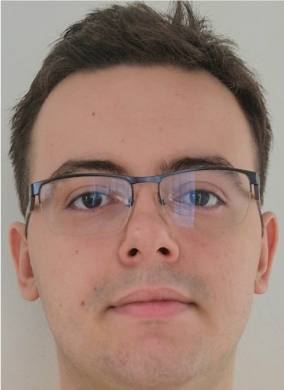

# Un poco de mí.
Soy Alfonso Adiego Luque, soy de Córdoba y me encuentro estudiando **DAW** *(Desarrollo de Aplicaciones Web).*

Tengo varios hobbies, pero mis favoritos son:
- Pescar.
- Restaurar algunos muebles antiguos.
  - Sillas
  - Mesas
  - Estanterias
- Hacer senderismo.

Mi correo electrónico que más uso y por donde me puedes contactar es **yestudiouco@gmail.com**

La cita que me parece la más cierta que he leido fue escrita por **Gustave Flaubert**, y dice así: 
> *La vida debe ser una incesante educación.*
